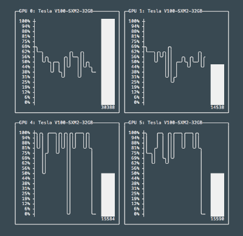

# GPU Usage
Graphically shows GPU usage through the use of line and bar plots on a given machine.



## Usage:
Simply run `gpu_usage.py` using python

```bash
python gpu_usage.py
```

The update interval can also be changed by using the `-i` flag.
The update interval is in seconds.
For example,

```bash
python gpu_usage.py -i 0.3  # Set update interval to every 0.3 seconds
```

## Attributions
This work uses code from [asciichartpy](https://pypi.org/project/asciichartpy/), licensed under the MIT license.
